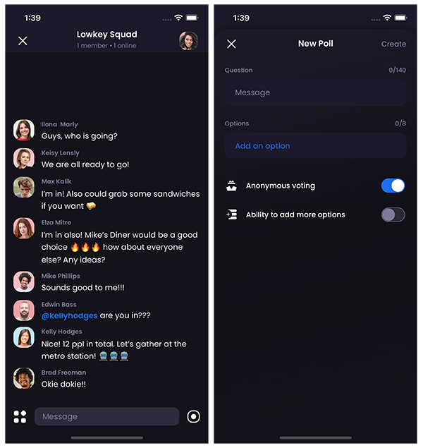

# Lowkey Poll concept

## Task

1. Based on design for a new feature create the UI and some basic functionality (textinput handlers text changes, switches, etc.)

2. Create a function that turns a random string from lowercase to uppercase. For example, if the coming string is ‘lowkey’, the outcome should be ‘LOWKEY’. To spice up this challenge, usage of the .toUpperCase() method is not allowed.

## Description

The task was implemented with Typescript and React Navigation without Expo. 

## Basic functionality:
- sending message (https://vimeo.com/533761524, https://vimeo.com/533761636)
- creating a poll (https://vimeo.com/533761592)
- editing the poll
- sending the poll
- voting in the poll widget (https://vimeo.com/533761592)
- on the right side of the message text field if to press an icon will appear alert with the result of the uppercase function (https://vimeo.com/533761618)



## Implemented only for iOS

```bash
npx react-native run-ios
```

